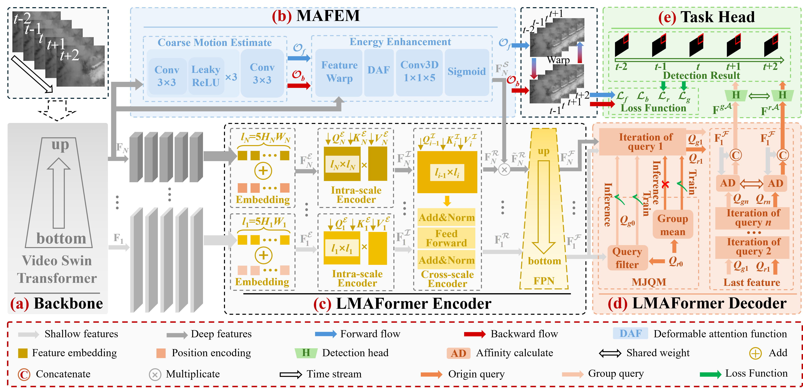

## PyTorch implementation of "LMAFormer: Local Motion Aware Transformer for Small Moving Infrared Target Detection" 
[Project](https://github.com/lifier/LMAFormer) - [Paper](https://ieeexplore.ieee.org/document/10758760)
<hr>

# Abstract
<p align="justify">
In temporal infrared small target detection, it is crucial to leverage the disparities in spatiotemporal characteristics between the target and the background to distinguish the former. However, remote imaging and the relative motion between the detection platform and the background cause significant coupling of spatiotemporal characteristics, making target detection highly challenging. To address these challenges, we propose a network named LMAFormer. First, we introduce a local motion-aware spatiotemporal attention mechanism that aligns and enhances multiframe features to extract local spatiotemporal salient features of targets while avoiding interference from moving backgrounds. Second, we employ a multiscale fusion transformer encoder that computes self-attention weights across and within scales during encoding, to establish multiscale correlations among different regions of temporal images, enabling motion background modeling. Last, we propose a multiframe joint query decoder. The shallowest feature map after multiscale feature propagation is mapped to initial query weights, which are refined through grouped convolutions to generate grouped query vectors. These are jointly optimized to encapsulate rich multiframe details, strengthening motion background modeling and target feature representation, improving prediction accuracy. Experimental results on the NUDT-MIRSDT, IRDST, and the established TSIRMT datasets demonstrate that our network outperforms state-of-the-art (SOTA) methods.
</p>


# Architecture
<p align="center">
  
</p>
Overall Architecture of LMAFormer.

# Installation


## Environment Setup
The experiments were done on Windows11 with python 3 using anaconda environment. Here is details on how to set up the conda environment.
(If you do not have anaconda 3 installed, first do it following the set up instruction from [here](https://www.anaconda.com/products/distribution)) 

* Create conda environment:
 
  ```create environment
  conda create -n LMAFormer python=3
  conda activate LMAFormer
  ```

* Install PyTorch from [here](https://pytorch.org/get-started/locally/). 

* Install MultiScaleDeformableAttention module:
  ```setup
  python ./MFIRSTD/models/ops/setup.py install
  
* Install other requirements:

  ```setup
  pip install -r requirements.txt

## Datasets
We evaluate network performance using NUDR-MIRSDT, IRDST and a self-built dataset TSIRMT

Download the datasets following the corresponding paper/project page and update dataset paths in 'datasets/path_config.py'. 
Here is the list of datasets used. 

- [NUDT-MIRSDT](https://pan.baidu.com/s/1pSN350eurMafLiHBQBnrPA?pwd=5whn) (Extraction code: 5whn)
- [IRDST](https://drive.google.com/file/d/1sb-32pydlpXvlNxwx9niT2t6KP9oMJID/view?usp=sharing)
- [TSIRMT](https://drive.google.com/drive/folders/1aWDNdUWkTOuV3fILbgLDEqM2N2erW05n?usp=sharing)

The NUDT-MIRSDT dataset requires the 'rearrange_dataset.py' program for path reconstruction, with 'rearrange_dataset.py' located at '/Datasets/rearrange_dataset.py'.
The dataset division is subject to the method in the Datasets folder.
## Download Trained Models 
Pretrained Swin backbones can be downloaded from their corresponding repository. 
- [Swin-S](https://github.com/SwinTransformer/storage/releases/download/v1.0.4/swin_small_patch244_window877_kinetics400_1k.pth)
- [Swin-B](https://github.com/SwinTransformer/storage/releases/download/v1.0.4/swin_base_patch244_window877_kinetics400_22k.pth)
- [Resnet-101 COCO](https://drive.google.com/file/d/1NGuaew1d0x0kdK2XR_J3Vlmc6OGtOe58/view?usp=sharing)

If you are interested in evaluating only, you can download the selected trained LMAFormer checkpoints from the links in the results table.   


# Training 

The models were trained and tested using a single NVIDIA 4080 GPU.  

* Train LMAFormer with Swin backbone on NUDT-MIRSDR, IRDST, TSIRMT datasets:
  ```
  python train_swin.py
  ```

# Inference
### Inference on NUDT-MIRSDT:
    ```
        python inference_swin.py  --model_path ./result/TSIRMT/checkpoint_NUDT-MIRSDT.pth  --dataset NUDT-MIRSDT --val_size 400 --flip --msc --output_dir ./predict/NUDT-MIRSDT  
    ```
    Expected miou: 73.26
### Inference on IRDST:
    ```
        python inference_swin.py  --model_path ./result/IRDST/checkpoint_IRDST.pth  --dataset IRDST --val_size 400 --flip --msc --output_dir ./predict/IRDST
    ```
    Expected miou: 59.17
### Inference on TSIRMT:
    ```
        python inference_swin.py  --model_path ./result/TSIRMT/checkpoint_TSIRMT.pth  --dataset TSIRMT --val_size 400 --flip --msc  --output_dir ./predict/TSIRMT
    ```
    Expected miou: 65.89

## Results Summary
### Results on NUDT-MIRSDT, IRDST and TSIRMT
| Dataset  | Checkpoint                                                                                        | IoU  | nIoU | Pd | Fa |
|-----------|---------------------------------------------------------------------------------------------------|------|------|------|------|
| NUDT-MIRSDT | [checkpoint](https://drive.google.com/file/d/1jBYw9jWAhTf7_pCRNWLfBMflhMq25_Vn/view?usp=sharing)  | 73.26 | 73.63 | 99.68 | 0.71 |
| IRDST | [checkpoint](https://drive.google.com/file/d/1LY2OWb3FyXB568vHpakJog1_qaDKOYZO/view?usp=sharing)  | 59.17 | 57.51 | 99.64 | 14.95 |
| TSIRMT | [checkpoint](https://drive.google.com/file/d/1lnVRmUSnrqZIF_j50z5hovpqiaNB4STY/view?usp=sharing)  | 65.89 | 65.63 | 86.10 | 185.78 |

### Acknowledgement
We would like to thank the open-source projects with  special thanks to [DETR](https://github.com/facebookresearch/detr)  and [VisTR](https://github.com/Epiphqny/VisTR) for making their code public. Part of the code in our project are collected and modified from several open source repositories.

## Citation
Please consider citing our paper in your publications if the project helps your research. BibTeX reference is as follow.

```
@ARTICLE{10758760,
  author={Huang, Yuanxin and Zhi, Xiyang and Hu, Jianming and Yu, Lijian and Han, Qichao and Chen, Wenbin and Zhang, Wei},
  journal={IEEE Transactions on Geoscience and Remote Sensing}, 
  title={LMAFormer: Local Motion Aware Transformer for Small Moving Infrared Target Detection}, 
  year={2024},
  volume={62},
  number={},
  pages={1-17},
  keywords={Feature extraction;Object detection;Transformers;Decoding;Three-dimensional displays;Computational modeling;Deep learning;Annotations;Visualization;Urban areas;Infrared small moving target detection;local motion aware;multiframe joint query;multiscale transformer encoder},
  doi={10.1109/TGRS.2024.3502663}}
```

